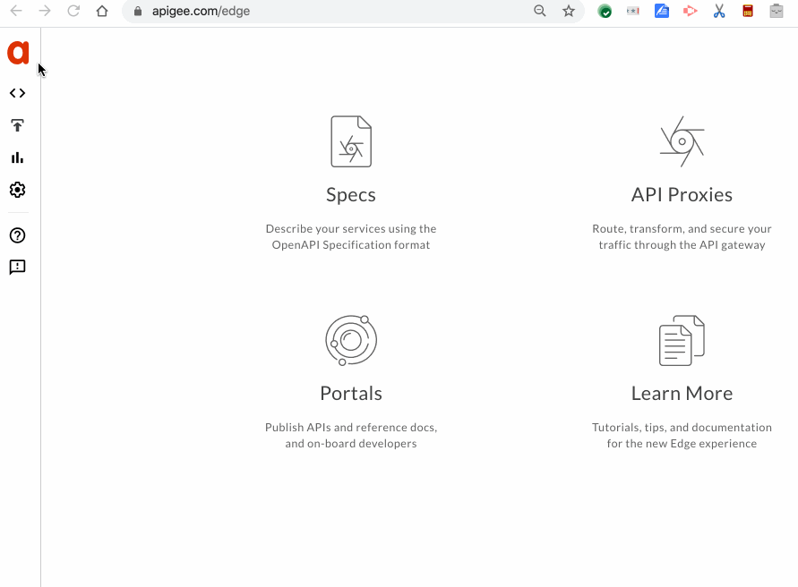

# Apigee Edge UE Tampermonkey script to Enlarge the Scollable org list

This is a [Tampermonkey](https://tampermonkey.net/) script that tweaks
the [Apigee Edge](https://apigee.com) UI to make the scrollable org list larger.
Also it adds a filter box.

## What is Tampermonkey?

Tampermonkey is a browser extension, that works on Firefox, Chrome, Safari,
etc. It is a pre-requisite to get this tweak of the Edge UI.

Tampermonkey allows the running of "user scripts" on webpages from particular
domains. It's a way of augmenting or modifying the behavior of a webpage, using
code provided by or approved by the user. The modification could be as simple as
changing the color or styling of a webpage; or it could be as complex as adding
new behavior or UI elements on a web page, or even adding new pages.

The user must install the custom script, and associate it to a particular domain
or set of domains. Thereafter, all pages loaded from those domains will run that
script.

## OK, How does this specific Tweak work?

The script registers for apigee.com . When it finds that the current page
displays an org dropdown, it adds a CSS style to the dropdown to make it
larger.

Then, it adds an input box on that list. When you type in the input box,
the list of orgs gets filtered.

The script is set to run after a brief delay after initial page load.

## Installing the script

If you don't have Tampermonkey loaded for your browser, you must first visit
[tampermonkey.net](https://tampermonkey.net/) and install it.

Then,

1 Use the tampermonkey menu to add a new script.
  

2. copy-paste the [scroll-org-list.user.js](lib/scroll-org-list.user.js) script into place.

3. Reload the browser tab that is displaying the Developer app.

4. Done.

## License

This user script is licensed under the [Apache 2.0 license](LICENSE).

## Compatibility

This user script works with Firefox, and Chrome on MacOS X.
It *ought to* work just fine on other combinations of browsers.
